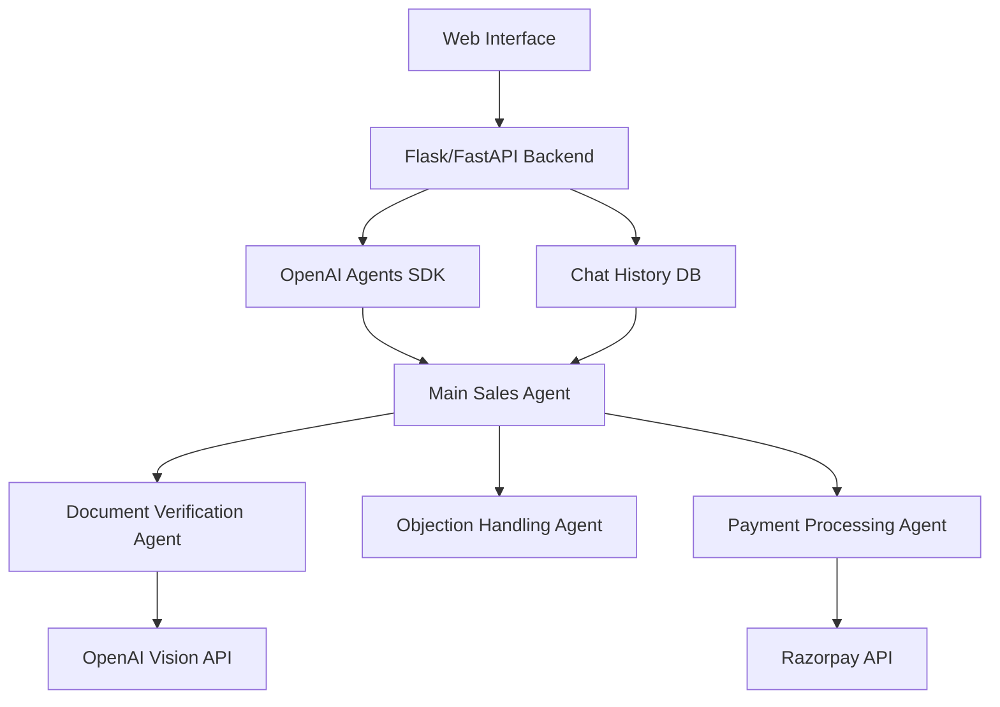
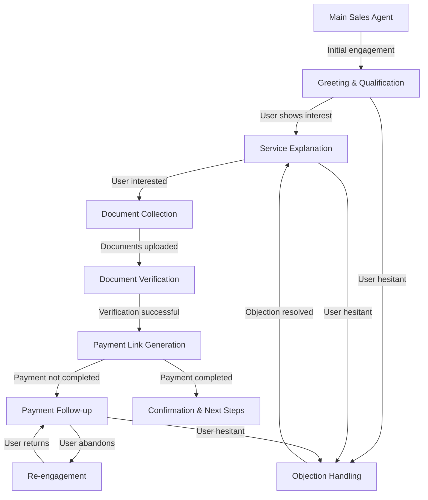

# RegisterKaro AI Sales Agent MVP - Implementation Plan

## Overview

The RegisterKaro AI Sales Agent will be a proactive, aggressive chatbot designed to convert potential clients for company incorporation services. It will be built using the OpenAI Agents SDK and will integrate with Razorpay for payment processing and OpenAI's Vision API for document verification.

This MVP aims to demonstrate the key capabilities described in the requirements:
- Dynamic, proactive follow-ups
- Payment link generation via Razorpay API
- Document verification with OpenAI Vision
- Website chat integration & real-time engagement
- Assertive sales tactics & objection handling

## System Architecture



## Core Components

### 1. Web Interface
- Simple HTML/CSS/JavaScript frontend with a chat widget
- Real-time communication with backend using WebSockets or Server-Sent Events
- Interface for document upload (for verification)
- Display for payment links

### 2. Backend Server
- Flask or FastAPI application to handle requests
- WebSocket or Server-Sent Events support for real-time communication
- File upload handling for documents
- Session management to track conversations

### 3. Agent Structure
- Main Sales Agent: Coordinates the overall sales flow
- Document Verification Agent: Handles document verification using OpenAI Vision
- Objection Handling Agent: Specialized in countering common objections
- Payment Processing Agent: Manages Razorpay integration

### 4. Database
- Simple storage for chat history and user information
- Could use SQLite for the MVP to minimize setup complexity

## Detailed Agent Design



## Implementation Phases

### Phase 1: Basic Setup & Core Agent Structure
1. Set up project structure and environment
2. Implement basic web interface with chat functionality
3. Create the main sales agent with simple conversation flow
4. Implement persistent follow-up mechanism

### Phase 2: Integration Features
1. Integrate OpenAI Vision API for document verification
2. Implement Razorpay payment link generation
3. Create storage for chat history and user information

### Phase 3: Enhanced Sales Capabilities
1. Implement objection handling patterns
2. Add assertive sales tactics and scripts
3. Develop proactive follow-up mechanisms
4. Create demo scenarios to showcase agent capabilities

## MVP Tech Stack

1. **Frontend**:
   - HTML, CSS, JavaScript
   - Simple WebSocket client or EventSource for real-time updates

2. **Backend**:
   - Python with Flask/FastAPI
   - WebSockets or Server-Sent Events for real-time chat
   - OpenAI Agents SDK for agent implementation
   
3. **APIs**:
   - OpenAI API (GPT-4 with Vision)
   - Razorpay API for payment links

4. **Storage**:
   - SQLite for the MVP (simplicity and quick setup)

## Detailed Implementation Steps

### 1. Project Setup

**Directory Structure**:
```
register_karo_agent/
├── app.py               # Main application file
├── agents/              # Agent definitions
│   ├── __init__.py
│   ├── sales_agent.py
│   ├── document_agent.py
│   └── payment_agent.py
├── tools/               # Function tools
│   ├── __init__.py
│   ├── document_tools.py
│   └── payment_tools.py
├── static/              # Static assets
│   ├── css/
│   └── js/
├── templates/           # HTML templates
│   └── index.html
└── config.py            # Configuration
```

**Dependencies**:
```python
# requirements.txt
openai>=1.0.0
fastapi>=0.104.0
uvicorn>=0.23.2
python-multipart>=0.0.6
websockets>=11.0.3
razorpay>=1.3.0
sqlalchemy>=2.0.0
pydantic>=2.0.0
```

### 2. Agent Implementation

**Main Sales Agent**:
```python
from pydantic import BaseModel, Field
from typing import List, Optional
from agents import Agent, function_tool

class CustomerInfo(BaseModel):
    name: str = Field(description="Customer's name")
    email: str = Field(description="Customer's email address")
    phone: Optional[str] = Field(description="Customer's phone number")
    company_type: str = Field(description="Type of company to be incorporated")
    
sales_agent = Agent(
    name="RegisterKaro Sales Agent",
    instructions="""You are an aggressive sales agent for RegisterKaro, a company incorporation service.
    Your goal is to convert potential clients by being proactive, pushy, and persistent.
    Follow up aggressively if the user shows hesitation.
    Use FOMO (Fear of Missing Out) and urgency tactics to drive conversions.
    Handle objections firmly and always push towards the next step in the sales funnel.
    Never accept the first 'no' - always try different approaches to overcome objections.
    
    For any prospect interaction, follow these guidelines:
    1. Start with a proactive greeting that creates urgency
    2. Qualify the prospect quickly to understand their business incorporation needs
    3. Explain services with emphasis on benefits and limited-time opportunities
    4. When user shows interest, ask for document upload
    5. After document verification, generate and share payment link
    6. Follow up aggressively if payment is not completed
    7. Confirm and celebrate when payment is made
    
    Never let the conversation go stale - if the user doesn't respond for more than 30 seconds,
    follow up with an urgent message.
    
    Common objections and how to handle them:
    - "I need to think about it" → Emphasize limited spots/time and risk of delaying
    - "It's too expensive" → Focus on ROI and the risk of waiting (possible fee increases)
    - "I'll do it later" → Create urgency about regulatory changes and competition
    - "I need to discuss with others" → Suggest securing spot now with option to cancel
    
    Always sound confident and assume the sale will happen.""",
    tools=[collect_user_info, verify_document, generate_payment_link, check_payment_status],
)
```

**Document Verification Agent**:
```python
document_verification_agent = Agent(
    name="Document Verification Agent",
    instructions="""You verify customer documents for company incorporation.
    Analyze uploaded documents using vision capabilities.
    Check for clarity and required information.
    Provide immediate feedback on document quality.
    Be assertive but helpful if documents need improvement.
    
    When analyzing documents:
    1. Check if the document is a valid ID or address proof
    2. Verify if all text is clearly legible
    3. Confirm key details are visible (name, number, date of issue, etc.)
    4. Look for signs of tampering or issues that could cause rejection
    
    Always respond quickly to maintain sales momentum.""",
    tools=[verify_document_with_vision],
)
```

**Payment Processing Agent**:
```python
payment_agent = Agent(
    name="Payment Processing Agent",
    instructions="""You handle payment processing for company incorporation.
    Generate payment links via Razorpay.
    Aggressively follow up on pending payments.
    Create urgency around payment completion.
    Celebrate successful payments and move customers to the next steps.
    
    When handling payments:
    1. Generate clear payment links with specific amounts
    2. Create urgency when sharing links ("The link is active now and valid for the next hour only")
    3. Check payment status and follow up if not completed within 5 minutes
    4. Use phrases like "secure your spot now" and "to avoid delays"
    5. After successful payment, confirm and move to next steps immediately
    
    Always maintain an assertive tone that assumes the payment will be completed.""",
    tools=[generate_razorpay_link, check_payment_status]
)
```

### 3. Function Tool Implementations

**User Information Collection**:
```python
@function_tool
def collect_user_info(
    name: str, 
    email: str, 
    phone: Optional[str] = None, 
    company_type: Optional[str] = None
) -> dict:
    """Collect and store user information."""
    # In a real implementation, this would store to a database
    user_info = {
        "name": name,
        "email": email,
        "phone": phone,
        "company_type": company_type or "Private Limited"
    }
    
    return {
        "success": True,
        "user_info": user_info,
        "next_step": "document_verification"
    }
```

**Document Verification Tool**:
```python
@function_tool
async def verify_document_with_vision(document_url: str) -> dict:
    """Verify a document using OpenAI's Vision API."""
    # Call OpenAI Vision API to analyze the document
    response = await client.chat.completions.create(
        model="gpt-4-vision-preview",
        messages=[
            {
                "role": "user",
                "content": [
                    {"type": "text", "text": "Analyze this document and check if it's a valid ID/document with clear information. Check for: 1) Document type 2) Clarity of text 3) Presence of required fields like name, ID number, date 4) Any issues that might cause rejection"},
                    {"type": "image_url", "image_url": {"url": document_url}}
                ]
            }
        ],
        max_tokens=300
    )
    
    # Extract analysis from response
    analysis = response.choices[0].message.content
    
    # Determine if document is valid based on analysis
    is_valid = "valid" in analysis.lower() and "clear" in analysis.lower()
    
    return {
        "is_valid": is_valid,
        "analysis": analysis,
        "next_steps": "proceed_to_payment" if is_valid else "request_new_document"
    }
```

**Razorpay Payment Tools**:
```python
@function_tool
def generate_razorpay_link(customer_info: dict, amount: int = 5000) -> dict:
    """Generate a Razorpay payment link."""
    # Call Razorpay API to create a payment link
    # This would typically make an HTTP request to Razorpay API
    
    # For MVP, we can simulate this with the real API implementation
    import razorpay
    
    client = razorpay.Client(auth=("rzp_test_key", "rzp_test_secret"))
    
    try:
        payment_link_data = {
            'amount': amount * 100,  # Amount in paise
            'currency': 'INR',
            'accept_partial': False,
            'description': 'Company Incorporation Services',
            'customer': {
                'name': customer_info.get('name', 'Customer'),
                'email': customer_info.get('email', 'customer@example.com'),
                'contact': customer_info.get('phone', '+919999999999')
            },
            'notify': {
                'sms': True,
                'email': True
            },
            'reminder_enable': True,
            'notes': {
                'company_type': customer_info.get('company_type', 'Private Limited')
            },
            'callback_url': 'https://registerkaro.example/callback',
            'callback_method': 'get'
        }
        
        # In MVP, comment this out and use the mock response below
        # response = client.payment_link.create(payment_link_data)
        # payment_link = response['short_url']
        
        # Mock response for MVP
        payment_link = f"https://rzp.io/i/example_{customer_info.get('email', '').replace('@', '_at_')}"
        
        return {
            "success": True,
            "payment_link": payment_link,
            "amount": amount,
            "currency": "INR",
            "expires_in": 3600  # 1 hour
        }
    except Exception as e:
        return {
            "success": False,
            "error": str(e)
        }

@function_tool
def check_payment_status(payment_id: str) -> dict:
    """Check the status of a payment."""
    # This would typically make an API call to Razorpay
    
    # For MVP, we can simulate this
    import random
    
    # Simulate a 30% chance of payment being completed
    payment_completed = random.random() < 0.3
    
    return {
        "success": True,
        "payment_completed": payment_completed,
        "status": "paid" if payment_completed else "pending"
    }
```

### 4. Web Interface Implementation

**HTML Template (index.html)**:
```html
<!DOCTYPE html>
<html lang="en">
<head>
    <meta charset="UTF-8">
    <meta name="viewport" content="width=device-width, initial-scale=1.0">
    <title>RegisterKaro - Company Incorporation Services</title>
    <link rel="stylesheet" href="/static/css/styles.css">
</head>
<body>
    <div class="main-content">
        <header>
            <h1>RegisterKaro</h1>
            <p>Your trusted partner for company incorporation services</p>
        </header>
        
        <section class="services">
            <h2>Our Services</h2>
            <div class="service-cards">
                <div class="card">
                    <h3>Private Limited Company</h3>
                    <p>Starting at ₹5,000 only</p>
                    <ul>
                        <li>Complete documentation</li>
                        <li>Fast processing</li>
                        <li>Expert guidance</li>
                    </ul>
                </div>
                
                <div class="card">
                    <h3>Limited Liability Partnership</h3>
                    <p>Starting at ₹6,000 only</p>
                    <ul>
                        <li>Complete documentation</li>
                        <li>Fast processing</li>
                        <li>Expert guidance</li>
                    </ul>
                </div>
                
                <div class="card">
                    <h3>One Person Company</h3>
                    <p>Starting at ₹4,500 only</p>
                    <ul>
                        <li>Complete documentation</li>
                        <li>Fast processing</li>
                        <li>Expert guidance</li>
                    </ul>
                </div>
            </div>
        </section>
    </div>
    
    <!-- Chat Widget -->
    <div class="chat-widget" id="chat-widget">
        <div class="chat-header">
            <h3>RegisterKaro Assistant</h3>
            <button id="minimize-chat">−</button>
        </div>
        
        <div class="chat-messages" id="chat-messages">
            <!-- Messages will be added here -->
        </div>
        
        <div class="document-upload-area" id="document-upload-area" style="display: none;">
            <p>Upload your document:</p>
            <input type="file" id="document-input" accept="image/*,.pdf">
            <button id="upload-document">Upload</button>
        </div>
        
        <div class="payment-link-area" id="payment-link-area" style="display: none;">
            <p>Complete your payment to proceed:</p>
            <a href="#" id="payment-link" class="payment-button">Pay Now</a>
        </div>
        
        <div class="chat-input">
            <input type="text" id="user-message" placeholder="Type your message...">
            <button id="send-message">Send</button>
        </div>
    </div>
    
    <!-- Chat Trigger Button (initially visible, hides when chat opens) -->
    <button class="chat-trigger" id="chat-trigger">
        Chat with us now to get a special offer!
    </button>
    
    <script src="/static/js/chat.js"></script>
</body>
</html>
```

**JavaScript (chat.js)**:
```javascript
document.addEventListener('DOMContentLoaded', function() {
    // Elements
    const chatWidget = document.getElementById('chat-widget');
    const chatTrigger = document.getElementById('chat-trigger');
    const minimizeChat = document.getElementById('minimize-chat');
    const chatMessages = document.getElementById('chat-messages');
    const userMessageInput = document.getElementById('user-message');
    const sendMessageButton = document.getElementById('send-message');
    const documentUploadArea = document.getElementById('document-upload-area');
    const documentInput = document.getElementById('document-input');
    const uploadDocumentButton = document.getElementById('upload-document');
    const paymentLinkArea = document.getElementById('payment-link-area');
    const paymentLink = document.getElementById('payment-link');
    
    // State
    let chatOpen = false;
    let conversationInactive = false;
    let inactivityTimer = null;
    let lastUserInteraction = Date.now();
    
    // Socket connection
    let socket;
    
    // Event listeners
    chatTrigger.addEventListener('click', openChat);
    minimizeChat.addEventListener('click', minimizeChat);
    sendMessageButton.addEventListener('click', sendMessage);
    userMessageInput.addEventListener('keypress', function(e) {
        if (e.key === 'Enter') {
            sendMessage();
        }
    });
    uploadDocumentButton.addEventListener('click', uploadDocument);
    
    // Functions
    function openChat() {
        chatWidget.style.display = 'flex';
        chatTrigger.style.display = 'none';
        chatOpen = true;
        
        // Start WebSocket connection
        initializeWebSocket();
        
        // Trigger automated welcome message after a short delay
        setTimeout(() => {
            // First message appears immediately
            addBotMessage("👋 Hi there! I'm your RegisterKaro assistant.");
            
            // Second message appears after a short delay
            setTimeout(() => {
                addBotMessage("I noticed you're interested in company incorporation. We have a special offer ending today! What type of company are you looking to register?");
            }, 1000);
        }, 500);
        
        // Start tracking user inactivity
        startInactivityTracking();
    }
    
    function minimizeChat() {
        chatWidget.style.display = 'none';
        chatTrigger.style.display = 'block';
        chatOpen = false;
    }
    
    function initializeWebSocket() {
        // Create WebSocket connection
        socket = new WebSocket(`ws://${window.location.host}/ws`);
        
        // Connection opened
        socket.addEventListener('open', function(event) {
            console.log('Connected to the WebSocket');
        });
        
        // Listen for messages
        socket.addEventListener('message', function(event) {
            const response = JSON.parse(event.data);
            
            if (response.type === 'message') {
                addBotMessage(response.text);
            } else if (response.type === 'show_document_upload') {
                showDocumentUpload();
            } else if (response.type === 'payment_link') {
                showPaymentLink(response.link);
            } else if (response.type === 'follow_up') {
                // Handle follow-up message specifically
                addFollowUpMessage(response.text);
            }
            
            // Reset inactivity tracking whenever we receive a message
            resetInactivityTracking();
        });
        
        // Handle WebSocket errors and disconnections
        socket.addEventListener('error', function(event) {
            console.error('WebSocket error:', event);
        });
        
        socket.addEventListener('close', function(event) {
            console.log('WebSocket connection closed');
            // Attempt to reconnect after a few seconds
            setTimeout(initializeWebSocket, 3000);
        });
    }
    
    function sendMessage() {
        const message = userMessageInput.value.trim();
        if (message === '') return;
        
        // Add user message to chat
        addUserMessage(message);
        userMessageInput.value = '';
        
        // Send to backend
        if (socket && socket.readyState === WebSocket.OPEN) {
            socket.send(JSON.stringify({
                type: 'message',
                text: message
            }));
        }
        
        // Reset inactivity tracking
        resetInactivityTracking();
    }
    
    function uploadDocument() {
        const file = documentInput.files[0];
        if (!file) {
            addBotMessage("Please select a file to upload.");
            return;
        }
        
        const formData = new FormData();
        formData.append('document', file);
        
        // Show loading message
        addBotMessage("Uploading and analyzing your document...");
        
        fetch('/upload-document', {
            method: 'POST',
            body: formData
        })
        .then(response => response.json())
        .then(data => {
            if (data.success) {
                // Hide document upload area after successful upload
                documentUploadArea.style.display = 'none';
                
                // The backend will send a verification result via WebSocket
            } else {
                addBotMessage("There was an issue with your document: " + data.error);
            }
        })
        .catch(error => {
            console.error('Error:', error);
            addBotMessage("There was an error uploading your document. Please try again.");
        });
        
        // Reset inactivity tracking
        resetInactivityTracking();
    }
    
    function showDocumentUpload() {
        documentUploadArea.style.display = 'block';
        // Scroll to make upload area visible
        chatMessages.scrollTop = chatMessages.scrollHeight;
    }
    
    function showPaymentLink(link) {
        paymentLinkArea.style.display = 'block';
        paymentLink.href = link;
        // Scroll to make payment area visible
        chatMessages.scrollTop = chatMessages.scrollHeight;
    }
    
    function addUserMessage(text) {
        const messageElement = document.createElement('div');
        messageElement.classList.add('message', 'user-message');
        messageElement.textContent = text;
        chatMessages.appendChild(messageElement);
        chatMessages.scrollTop = chatMessages.scrollHeight;
    }
    
    function addBotMessage(text) {
        const messageElement = document.createElement('div');
        messageElement.classList.add('message', 'bot-message');
        messageElement.innerHTML = text;
        chatMessages.appendChild(messageElement);
        chatMessages.scrollTop = chatMessages.scrollHeight;
    }
    
    function addFollowUpMessage(text) {
        const messageElement = document.createElement('div');
        messageElement.classList.add('message', 'bot-message', 'follow-up');
        messageElement.innerHTML = text;
        // Add a subtle animation to highlight the follow-up
        messageElement.style.animation = 'highlight 2s';
        chatMessages.appendChild(messageElement);
        chatMessages.scrollTop = chatMessages.scrollHeight;
    }
    
    function startInactivityTracking() {
        // Reset the timer
        resetInactivityTracking();
        
        // Set up event listeners for user activity
        document.addEventListener('mousemove', userActivity);
        document.addEventListener('keypress', userActivity);
    }
    
    function resetInactivityTracking() {
        lastUserInteraction = Date.now();
        conversationInactive = false;
        
        // Clear any existing timer
        if (inactivityTimer) {
            clearTimeout(inactivityTimer);
        }
        
        // Set new timer for 30 seconds
        inactivityTimer = setTimeout(checkUserActivity, 30000);
    }
    
    function userActivity() {
        lastUserInteraction = Date.now();
    }
    
    function checkUserActivity() {
        const currentTime = Date.now();
        const elapsedTime = currentTime - lastUserInteraction;
        
        // If more than 30 seconds have passed and the chat is open
        if (elapsedTime >= 30000 && chatOpen && !conversationInactive) {
            conversationInactive = true;
            
            // Send inactivity notification to server
            if (socket && socket.readyState === WebSocket.OPEN) {
                socket.send(JSON.stringify({
                    type: 'inactive',
                    duration: Math.floor(elapsedTime / 1000)
                }));
            }
        }
        
        // Set the next check
        inactivityTimer = setTimeout(checkUserActivity, 10000);
    }
    
    // Auto-trigger chat after 30 seconds on page
    setTimeout(() => {
        if (!chatOpen) {
            openChat();
        }
    }, 30000);
});
```

**CSS (styles.css)**:
```css
/* Base styles */
* {
    margin: 0;
    padding: 0;
    box-sizing: border-box;
    font-family: 'Arial', sans-serif;
}

body {
    min-height: 100vh;
    background-color: #f5f5f5;
    padding: 20px;
}

.main-content {
    max-width: 1200px;
    margin: 0 auto;
    padding: 20px;
}

header {
    text-align: center;
    padding: 20px 0;
    margin-bottom: 40px;
}

header h1 {
    font-size: 2.5rem;
    color: #2c3e50;
}

header p {
    color: #7f8c8d;
    font-size: 1.2rem;
}

/* Service cards */
.services h2 {
    text-align: center;
    margin-bottom: 30px;
    color: #2c3e50;
}

.service-cards {
    display: flex;
    flex-wrap: wrap;
    justify-content: center;
    gap: 20px;
}

.card {
    background-color: white;
    border-radius: 8px;
    box-shadow: 0 4px 6px rgba(0, 0, 0, 0.1);
    padding: 20px;
    width: 300px;
    transition: transform 0.3s ease;
}

.card:hover {
    transform: translateY(-5px);
}

.card h3 {
    color: #3498db;
    margin-bottom: 10px;
}

.card p {
    font-weight: bold;
    color: #e74c3c;
    margin-bottom: 15px;
}

.card ul {
    list-style-position: inside;
    color: #2c3e50;
}

.card li {
    margin-bottom: 5px;
}

/* Chat widget */
.chat-widget {
    position: fixed;
    bottom: 20px;
    right: 20px;
    width: 350px;
    height: 500px;
    background-color: white;
    border-radius: 10px;
    box-shadow: 0 4px 15px rgba(0, 0, 0, 0.2);
    display: none;
    flex-direction: column;
    overflow: hidden;
    z-index: 1000;
}

.chat-header {
    display: flex;
    justify-content: space-between;
    align-items: center;
    padding: 15px;
    background-color: #3498db;
    color: white;
}

.chat-header button {
    background: none;
    border: none;
    color: white;
    font-size: 1.2rem;
    cursor: pointer;
}

.chat-messages {
    flex-grow: 1;
    padding: 15px;
    overflow-y: auto;
    display: flex;
    flex-direction: column;
    gap: 10px;
}

.message {
    padding: 10px 15px;
    border-radius: 18px;
    max-width: 80%;
    word-wrap: break-word;
}

.user-message {
    background-color: #e1f5fe;
    align-self: flex-end;
    color: #01579b;
}

.bot-message {
    background-color: #f1f1f1;
    align-self: flex-start;
    color: #333;
}

.follow-up {
    border-left: 3px solid #e74c3c;
}

.chat-input {
    display: flex;
    padding: 10px;
    border-top: 1px solid #ddd;
}

.chat-input input {
    flex-grow: 1;
    padding: 10px;
    border: 1px solid #ddd;
    border-radius: 20px;
    margin-right: 10px;
}

.chat-input button {
    background-color: #3498db;
    color: white;
    border: none;
    border-radius: 20px;
    padding: 10px 15px;
    cursor: pointer;
}

/* Document upload area */
.document-upload-area {
    padding: 15px;
    background-color: #f9f9f9;
    border-top: 1px solid #ddd;
}

.document-upload-area p {
    margin-bottom: 10px;
    font-weight: bold;
}

.document-upload-area input[type="file"] {
    margin-bottom: 10px;
    width: 100%;
}

.document-upload-area button {
    background-color: #3498db;
    color: white;
    border: none;
    border-radius: 20px;
    padding: 10px 15px;
    cursor: pointer;
    width: 100%;
}

/* Payment link area */
.payment-link-area {
    padding: 15px;
    background-color: #f9f9f9;
    border-top: 1px solid #ddd;
    text-align: center;
}

.payment-link-area p {
    margin-bottom: 10px;
    font-weight: bold;
}

.payment-button {
    display: block;
    background-color: #e74c3c;
    color: white;
    text-decoration: none;
    padding: 12px 20px;
    border-radius: 25px;
    font-weight: bold;
    transition: background-color 0.3s;
    animation: pulse 2s infinite;
}

.payment-button:hover {
    background-color: #c0392b;
}

/* Chat trigger button */
.chat-trigger {
    position: fixed;
    bottom: 20px;
    right: 20px;
    background-color: #e74c3c;
    color: white;
    border: none;
    border-radius: 25px;
    padding: 15px 25px;
    font-weight: bold;
    cursor: pointer;
    animation: pulse 2s infinite;
    z-index: 999;
    box-shadow: 0 4px 8px rgba(0, 0, 0, 0.2);
}

/* Animations */
@keyframes pulse {
    0% {
        transform: scale(1);
        box-shadow: 0 0 0 0 rgba(231, 76, 60, 0.7);
    }
    70% {
        transform: scale(1.05);
        box-shadow: 0 0 0 10px rgba(231, 76, 60, 0);
    }
    100% {
        transform: scale(1);
        box-shadow: 0 0 0 0 rgba(231, 76, 60, 0);
    }
}

@keyframes highlight {
    0% {
        background-color: rgba(231, 76, 60, 0.2);
    }
    100% {
        background-color: #f1f1f1;
    }
}

/* Responsive design */
@media (max-width: 768px) {
    .chat-widget {
        width: 90%;
        height: 70vh;
        bottom: 10px;
        right: 5%;
        left: 5%;
    }
    
    .chat-trigger {
        width: 90%;
        right: 5%;
        left: 5%;
        text-align: center;
    }
}
```

### 5. Backend Implementation

**Main Application (app.py)**:
```python
import os
import json
import uuid
import asyncio
from datetime import datetime
from typing import List, Dict, Any, Optional
from fastapi import FastAPI, WebSocket, WebSocketDisconnect, File, UploadFile, Form, Request
from fastapi.responses import HTMLResponse
from fastapi.staticfiles import StaticFiles
from fastapi.templating import Jinja2Templates
from pydantic import BaseModel
import uvicorn
from agents import Agent, Runner, function_tool
from starlette.websockets import WebSocketState

# Import our custom agents and tools
from agents.sales_agent import sales_agent
from agents.document_agent import document_verification_agent
from agents.payment_agent import payment_agent

# Create FastAPI app
app = FastAPI()

# Mount static files
app.mount("/static", StaticFiles(directory="static"), name="static")

# Templates
templates = Jinja2Templates(directory="templates")

# In-memory storage for the MVP
chat_histories = {}  # session_id -> list of messages
user_info = {}  # session_id -> user info
document_status = {}  # session_id -> document status
payment_status = {}  # session_id -> payment status

# Active WebSocket connections
active_connections: Dict[str, WebSocket] = {}

# Helper functions
async def send_bot_message(websocket: WebSocket, text: str, message_type: str = "message"):
    """Send a message from the bot to the client."""
    await websocket.send_text(json.dumps({
        "type": message_type,
        "text": text
    }))

async def send_payment_link(websocket: WebSocket, link: str):
    """Send a payment link to the client."""
    await websocket.send_text(json.dumps({
        "type": "payment_link",
        "link": link
    }))

async def request_document_upload(websocket: WebSocket):
    """Request document upload from the client."""
    await websocket.send_text(json.dumps({
        "type": "show_document_upload"
    }))

async def process_message(session_id: str, message: str, websocket: WebSocket):
    """Process a user message using the appropriate agent."""
    
    # Add to chat history
    if session_id not in chat_histories:
        chat_histories[session_id] = []
    
    chat_histories[session_id].append({"role": "user", "content": message})
    
    # Determine which agent to use based on conversation state
    # This is a simplified flow for the MVP
    agent_to_use = sales_agent  # Default to sales agent
    
    # If we're at the document verification stage
    if session_id in document_status and document_status[session_id].get("pending"):
        agent_to_use = document_verification_agent
    
    # If we're at the payment stage
    if session_id in payment_status and payment_status[session_id].get("pending"):
        agent_to_use = payment_agent
    
    # Run the agent
    try:
        # Prepare context from chat history
        context = "\n".join([f"{m['role']}: {m['content']}" for m in chat_histories[session_id][-5:]])
        
        # Add user info to context if available
        if session_id in user_info:
            context += f"\nUser info: {json.dumps(user_info[session_id])}"
        
        # Add document status to context if available  
        if session_id in document_status:
            context += f"\nDocument status: {json.dumps(document_status[session_id])}"
            
        # Add payment status to context if available
        if session_id in payment_status:
            context += f"\nPayment status: {json.dumps(payment_status[session_id])}"
        
        # Create the prompt
        prompt = f"Context:\n{context}\n\nUser's latest message: {message}\n\nRespond as an aggressive sales agent."
        
        # Run the agent
        result = await Runner.run(agent_to_use, input=prompt)
        response = result.final_output
        
        # Add to chat history
        chat_histories[session_id].append({"role": "assistant", "content": response})
        
        # Send response to client
        await send_bot_message(websocket, response)
        
        # Check for special commands in the response
        if "upload your document" in response.lower() or "send your document" in response.lower():
            # Request document upload
            await request_document_upload(websocket)
            
            # Update document status
            document_status[session_id] = {"pending": True}
            
        elif "payment link" in response.lower() and "rzp.io" in response.lower():
            # Extract payment link with regex
            import re
            pattern = r'https://rzp\.io/[a-zA-Z0-9/\-_]+'
            matches = re.findall(pattern, response)
            
            if matches:
                payment_link = matches[0]
                
                # Send payment link to client
                await send_payment_link(websocket, payment_link)
                
                # Update payment status
                payment_status[session_id] = {"pending": True, "link": payment_link}
        
    except Exception as e:
        print(f"Error processing message: {e}")
        await send_bot_message(websocket, "I'm having trouble processing your request. Please try again.")

async def handle_inactivity(session_id: str, websocket: WebSocket):
    """Handle user inactivity with follow-ups."""
    if session_id not in chat_histories:
        return
    
    # Get the last few messages
    last_messages = chat_histories[session_id][-3:]
    
    # Determine appropriate follow-up based on conversation state
    follow_up_message = "Just checking in - are you still there? I'm here to help with your company registration."
    
    # If we're at the document stage
    if session_id in document_status and document_status[session_id].get("pending"):
        follow_up_message = "I noticed you haven't uploaded your document yet. Remember, we need this to proceed with your company registration. Can I help with any concerns about the document requirements?"
    
    # If we're at the payment stage
    if session_id in payment_status and payment_status[session_id].get("pending"):
        follow_up_message = "I noticed you haven't completed the payment yet. This special offer is only valid for a limited time. Is there anything preventing you from proceeding with the payment now?"
    
    # Add to chat history
    chat_histories[session_id].append({"role": "assistant", "content": follow_up_message})
    
    # Send follow-up message
    if websocket.client_state == WebSocketState.CONNECTED:
        await send_bot_message(websocket, follow_up_message, "follow_up")

# Routes
@app.get("/", response_class=HTMLResponse)
async def get_home(request: Request):
    """Render the home page."""
    return templates.TemplateResponse("index.html", {"request": request})

@app.websocket("/ws")
async def websocket_endpoint(websocket: WebSocket):
    """WebSocket endpoint for chat communication."""
    await websocket.accept()
    
    # Generate a session ID
    session_id = str(uuid.uuid4())
    active_connections[session_id] = websocket
    
    try:
        while True:
            data = await websocket.receive_text()
            data_json = json.loads(data)
            
            if data_json["type"] == "message":
                # Process user message
                await process_message(session_id, data_json["text"], websocket)
            elif data_json["type"] == "inactive":
                # Handle user inactivity
                await handle_inactivity(session_id, websocket)
    except WebSocketDisconnect:
        del active_connections[session_id]
    except Exception as e:
        print(f"WebSocket error: {e}")
        if session_id in active_connections:
            del active_connections[session_id]

@app.post("/upload-document")
async def upload_document(document: UploadFile = File(...), session_id: str = Form(...)):
    """Handle document upload."""
    # Create uploads directory if it doesn't exist
    os.makedirs("uploads", exist_ok=True)
    
    # Save the uploaded file
    file_path = f"uploads/{uuid.uuid4()}_{document.filename}"
    with open(file_path, "wb") as f:
        f.write(await document.read())
    
    # Update document status
    document_status[session_id] = {
        "pending": False,
        "file_path": file_path,
        "uploaded_at": datetime.now().isoformat()
    }
    
    # Process document with vision API
    try:
        from tools.document_tools import verify_document_with_vision
        
        # Convert local path to URL for the MVP
        # In production, this would be a publicly accessible URL
        document_url = f"file://{os.path.abspath(file_path)}"
        
        # Verify document
        verification_result = await verify_document_with_vision(document_url)
        
        # Update document status
        document_status[session_id].update({
            "verified": verification_result["is_valid"],
            "analysis": verification_result["analysis"],
            "next_steps": verification_result["next_steps"]
        })
        
        # Send response to client
        if session_id in active_connections:
            websocket = active_connections[session_id]
            
            if verification_result["is_valid"]:
                await send_bot_message(
                    websocket,
                    "Thank you! I've verified your document and everything looks good. We can now proceed with the registration process."
                )
                
                # If document is valid, transition to payment step
                # Generate and send payment link
                from tools.payment_tools import generate_razorpay_link
                
                # Use session user info or default
                customer_info = user_info.get(session_id, {"name": "Customer", "email": f"customer_{session_id[:8]}@example.com"})
                
                payment_data = generate_razorpay_link(customer_info)
                
                if payment_data["success"]:
                    payment_status[session_id] = {
                        "pending": True,
                        "link": payment_data["payment_link"],
                        "amount": payment_data["amount"],
                        "currency": payment_data["currency"]
                    }
                    
                    # Send payment link message
                    await send_bot_message(
                        websocket,
                        f"Great news! Your document has been verified. To proceed with your company registration, please complete the payment of {payment_data['currency']} {payment_data['amount']} through this link: {payment_data['payment_link']}\n\nThis exclusive offer is only valid for the next 60 minutes, so I recommend completing the payment right away to secure your registration."
                    )
                    
                    # Send payment link to show in UI
                    await send_payment_link(websocket, payment_data["payment_link"])
            else:
                # If document is not valid, ask for a new one
                await send_bot_message(
                    websocket,
                    f"I've reviewed your document, but there seems to be an issue: {verification_result['analysis']}\n\nCould you please upload a clearer version of the document? This will help us process your registration faster."
                )
                
                # Request another document upload
                await request_document_upload(websocket)
        
        return {"success": True, "is_valid": verification_result["is_valid"]}
        
    except Exception as e:
        print(f"Error processing document: {e}")
        return {"success": False, "error": str(e)}

# Main entry point
if __name__ == "__main__":
    uvicorn.run("app:app", host="0.0.0.0", port=8000, reload=True)
```

## Testing Strategy

### 1. Unit Tests

Create unit tests for:
- Individual function tools
- Document verification logic
- Payment link generation
- Response formatting

Example test file structure:
```
tests/
├── test_document_tools.py
├── test_payment_tools.py
├── test_sales_agent.py
└── test_app.py
```

### 2. Integration Tests

Test the integration between:
- WebSocket connections and agent responses
- Document uploads and verification
- Payment link generation and status tracking

### 3. End-to-End Tests

Create scenario-based tests to simulate:
- Complete sales flows
- Objection handling scenarios
- Document verification scenarios
- Payment processing scenarios

## Deployment Plan

1. Local Development:
   - Set up the development environment
   - Configure API keys for OpenAI and Razorpay
   - Test all functionality locally

2. Staging Deployment:
   - Deploy to a staging environment
   - Perform integration testing
   - Verify all workflows work as expected

3. Production Deployment:
   - Deploy the MVP to a production environment
   - Monitor for any issues
   - Collect feedback for improvements

## Time Estimate

- Phase 1 (Basic Setup & Core Agent Structure): 3-4 days
- Phase 2 (Integration Features): 2-3 days
- Phase 3 (Enhanced Sales Capabilities): 2-3 days
- Testing & Refinement: 2 days

Total: Approximately 9-12 days for a working MVP.

## Future Enhancements

After the MVP is complete, the following enhancements could be considered:

1. **Analytics & Reporting**:
   - Track conversion rates
   - Analyze objection patterns
   - Monitor payment completion rates

2. **Enhanced AI**:
   - Train on successful sales conversations
   - A/B test different sales strategies
   - Personalize approaches based on user behavior

3. **Integration Expansion**:
   - Add more payment providers
   - Integrate with CRM systems
   - Connect to document management systems

4. **UI/UX Improvements**:
   - More sophisticated chat interface
   - Mobile app version
   - Multi-language support

5. **Scalability**:
   - Optimize for high-traffic scenarios
   - Add caching for improved performance
   - Implement load balancing